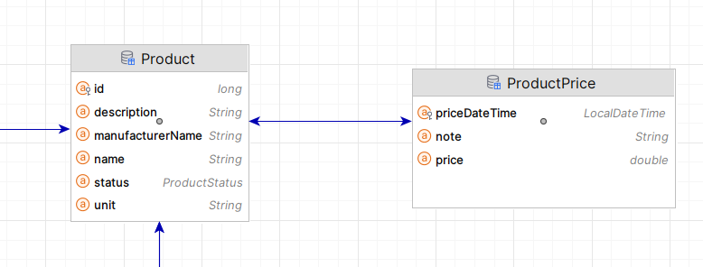

# on tap thi GK java ee
## anh minh hoa

## note
* create:
    - Web Aplication - tomcat - gradle - vn.iuh.edu.fit.se - Artifact = "GK"
    - Web Profile 9.1
    - lib
      mariadb
      //for logging
      implementation 'org.slf4j:slf4j-api:2.0.9'
      implementation 'org.slf4j:slf4j-simple:2.0.9'
      JPA
* persistence.xml:

        <persistence-unit name="lab_ontap" transaction-type="RESOURCE_LOCAL">
        
        <provider>org.eclipse.persistence.jpa.PersistenceProvider</provider>
        <class>vn.iuh.edu.fit.se.model.Product</class>

        <exclude-unlisted-classes>false</exclude-unlisted-classes>

        <properties>
            <property name="jakarta.persistence.jdbc.driver" value="org.mariadb.jdbc.Driver"/>
            <property name="jakarta.persistence.jdbc.url" value="jdbc:mariadb://localhost:3307/mydb_ontap?createDatabaseIfNotExit=true"/>
            <property name="jakarta.persistence.jdbc.user" value="root"/>
            <property name="jakarta.persistence.jdbc.password" value="sapassword"/>
            <property name="jakarta.persistence.schema-generation.database.action" value="create"/>

            <!-- logging-->
            <property name="eclipselink.logging.level.sql" value="FINE"/>
            <property name="eclipselink.logging.parameters" value="true"/>
        </properties>

        </persistence-unit>

