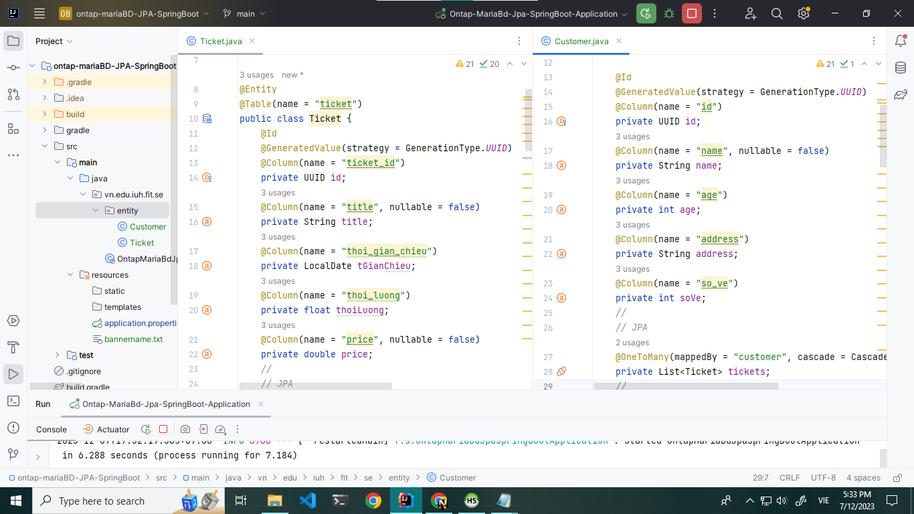
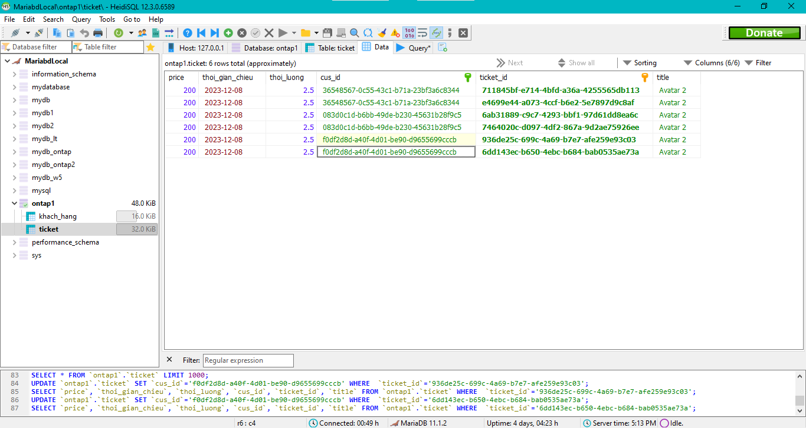
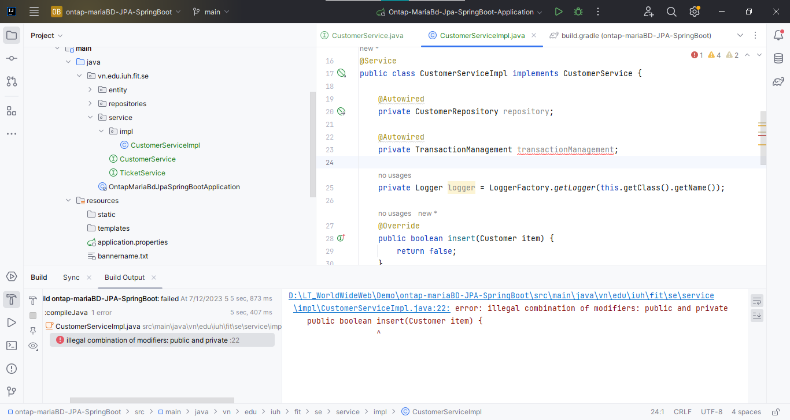

# ôn tập spring boot - jpa maridb

- 1 khách hàng có nhiều vé - 1 vé có 1 khách hàng :
  - khách hàng: 
    - id, name, age, address, soVe(số vé đã mua)
  - vé xem phim:
    - id, title(ten phim, ...), tgianChieu, thoiLuong, price;
## tài liệu 
* CRUD thymeleaf - ( [link](https://www.baeldung.com/spring-boot-crud-thymeleaf) )
## Ảnh minh họa
* Ảnh code:

* Ảnh mariabd:

* Ảnh web:
* Ảnh error:
* 
# Getting Started

### Reference Documentation
For further reference, please consider the following sections:

* [Official Gradle documentation](https://docs.gradle.org)
* [Spring Boot Gradle Plugin Reference Guide](https://docs.spring.io/spring-boot/docs/3.2.0/gradle-plugin/reference/html/)
* [Create an OCI image](https://docs.spring.io/spring-boot/docs/3.2.0/gradle-plugin/reference/html/#build-image)
* [Spring Boot DevTools](https://docs.spring.io/spring-boot/docs/3.2.0/reference/htmlsingle/index.html#using.devtools)
* [Spring Data JPA](https://docs.spring.io/spring-boot/docs/3.2.0/reference/htmlsingle/index.html#data.sql.jpa-and-spring-data)
* [Thymeleaf](https://docs.spring.io/spring-boot/docs/3.2.0/reference/htmlsingle/index.html#web.servlet.spring-mvc.template-engines)
* [Spring Web](https://docs.spring.io/spring-boot/docs/3.2.0/reference/htmlsingle/index.html#web)
* [Spring Web Services](https://docs.spring.io/spring-boot/docs/3.2.0/reference/htmlsingle/index.html#io.webservices)

### Guides
The following guides illustrate how to use some features concretely:

* [Accessing Data with JPA](https://spring.io/guides/gs/accessing-data-jpa/)
* [Handling Form Submission](https://spring.io/guides/gs/handling-form-submission/)
* [Building a RESTful Web Service](https://spring.io/guides/gs/rest-service/)
* [Serving Web Content with Spring MVC](https://spring.io/guides/gs/serving-web-content/)
* [Building REST services with Spring](https://spring.io/guides/tutorials/rest/)
* [Producing a SOAP web service](https://spring.io/guides/gs/producing-web-service/)

### Additional Links
These additional references should also help you:

* [Gradle Build Scans – insights for your project's build](https://scans.gradle.com#gradle)

